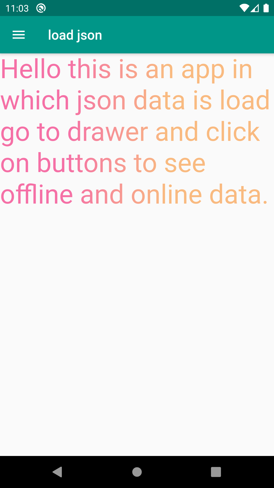
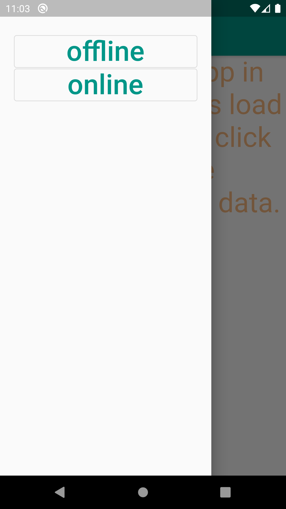
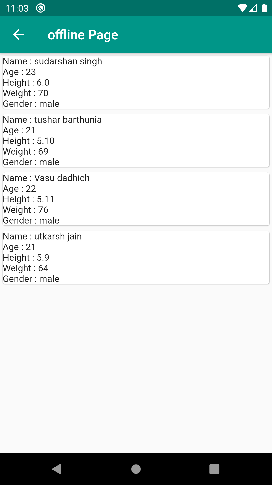
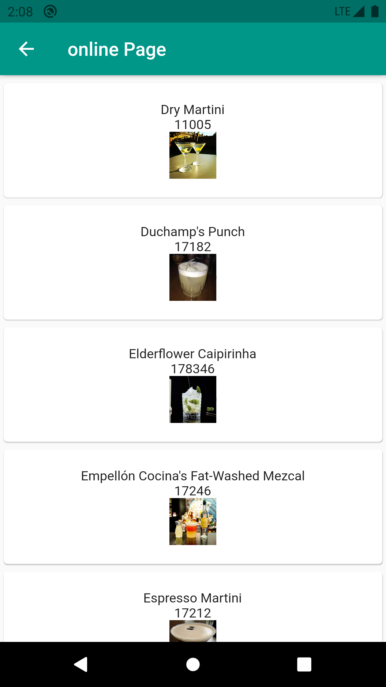

# flutter json data fetch application

<table style="width:100%">
  <tr>
    <th>HomePage</th>
    <th>Drawer</th>
    <th>Offline</th>
    <th>Online</th>
  </tr>
  <tr>
    <td></td>
    <td></td>
    <td></td>
    <td></td>
  </tr>
</table>

